<div align="center">

```
  ██╗███████╗██╗████████╗██████╗ ██████╗  ██████╗ ██╗  ██╗██╗   ██╗
  ██║██╔════╝██║╚══██╔══╝██╔══██╗██╔══██╗██╔═══██╗╚██╗██╔╝╚██╗ ██╔╝
  ██║███████╗██║   ██║   ██████╔╝██████╔╝██║   ██║ ╚███╔╝  ╚████╔╝ 
  ██║╚════██║██║   ██║   ██╔═══╝ ██╔══██╗██║   ██║ ██╔██╗   ╚██╔╝  
  ██║███████║██║   ██║   ██║     ██║  ██║╚██████╔╝██╔╝ ██╗   ██║   
  ╚═╝╚══════╝╚═╝   ╚═╝   ╚═╝     ╚═╝  ╚═╝ ╚═════╝ ╚═╝  ╚═╝   ╚═╝  
```

# ISITPROXY -- Advanced Proxy Checker & Intelligence Tool

**v1.1** | Developed By **Hayder** | Property of **Qamrix Tech**

[](https://www.python.org/downloads/)
[](LICENSE)

*Building intelligent solutions that drive progress and shape the future.*

</div>

---

## What is ISITPROXY?

ISITPROXY is a proxy checker that tells you which of your proxies actually work, how fast they are, and what kind of traffic they support. It also gives you details like country, ISP, anonymity level, and whether the proxy can access Google.

Load your proxies, hit check, and get a clean list of working ones -- sorted by speed and saved automatically.

**Contact:** [qamrixtech@gmail.com](mailto:qamrixtech@gmail.com) | [GitHub](https://github.com/qamrixtech/isitproxy)

---

## Screenshots

<table>
  <tr>
    <td align="center"><b>Launcher</b><br><sub>Auto-detects Python, installs dependencies</sub></td>
    <td align="center"><b>Main Menu</b><br><sub>Navigate with arrow keys</sub></td>
    <td align="center"><b>Settings</b><br><sub>Toggle options with spacebar</sub></td>
  </tr>
  <tr>
    <td>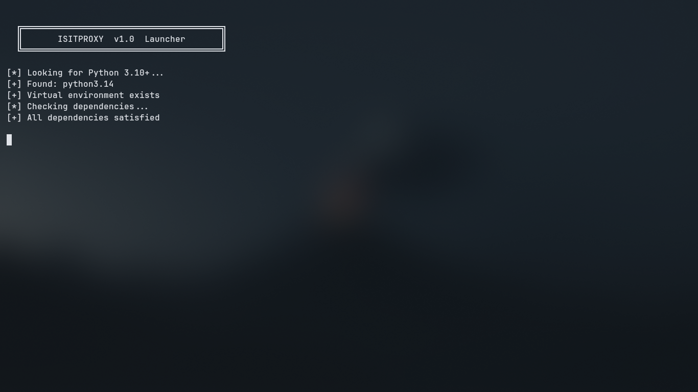</td>
    <td>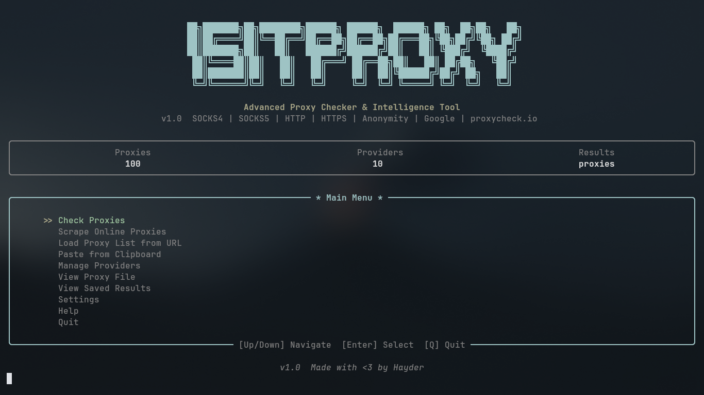</td>
    <td>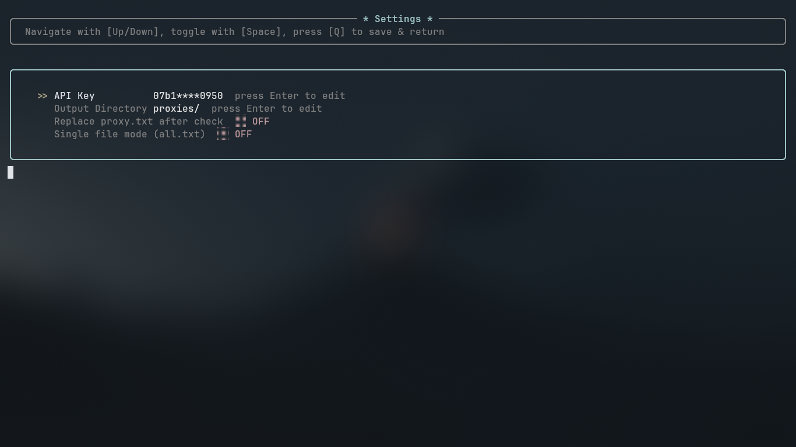</td>
  </tr>
</table>

### Check Proxies

<table>
  <tr>
    <td align="center"><b>Select Mode</b><br><sub>Fast, Standard, or Custom</sub></td>
    <td align="center"><b>Configure Check</b><br><sub>Concurrency, timeout, types</sub></td>
    <td align="center"><b>Checking (Stream)</b><br><sub>Results appear live</sub></td>
  </tr>
  <tr>
    <td>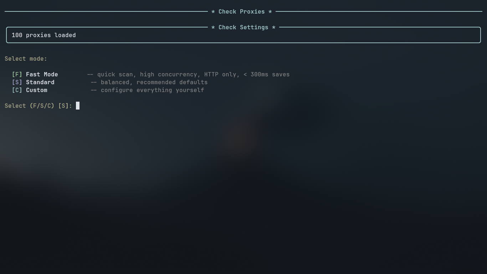</td>
    <td>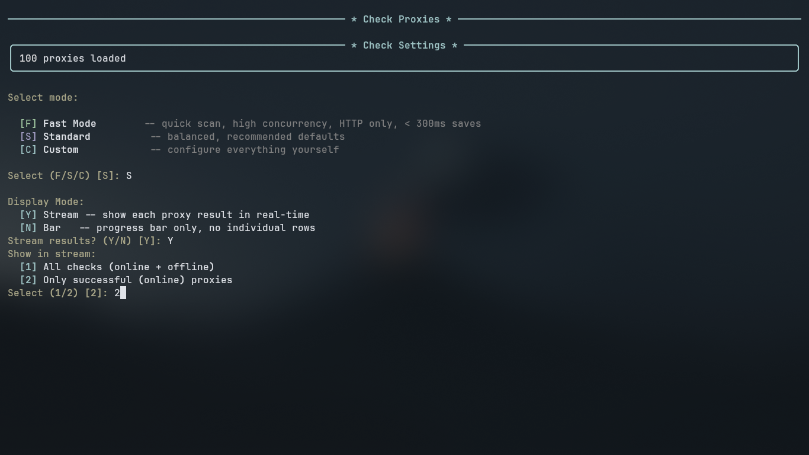</td>
    <td>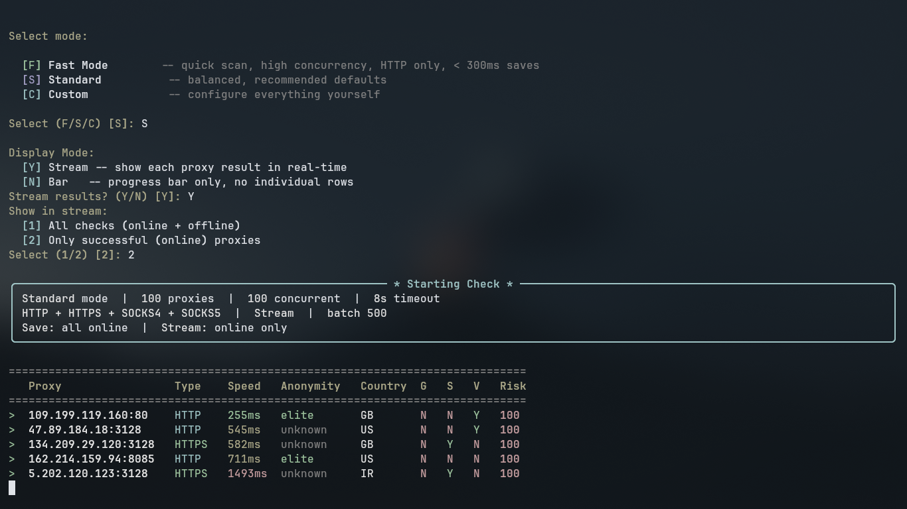</td>
  </tr>
  <tr>
    <td align="center"><b>Bar Mode</b><br><sub>Progress bar for large lists</sub></td>
    <td align="center"><b>Check Complete</b><br><sub>Summary with stats</sub></td>
    <td align="center"><b>Filter Results</b><br><sub>By type, country, speed</sub></td>
  </tr>
  <tr>
    <td>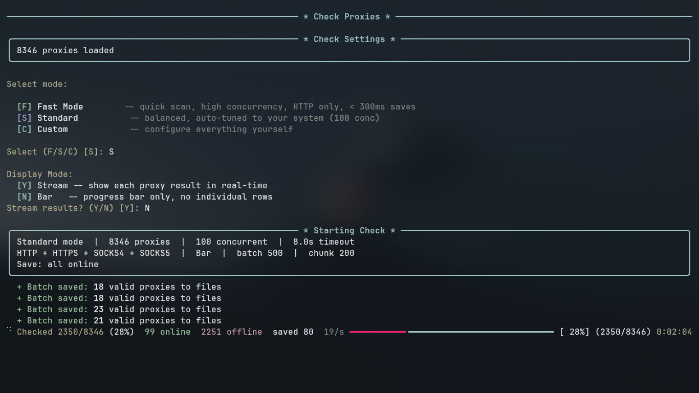</td>
    <td>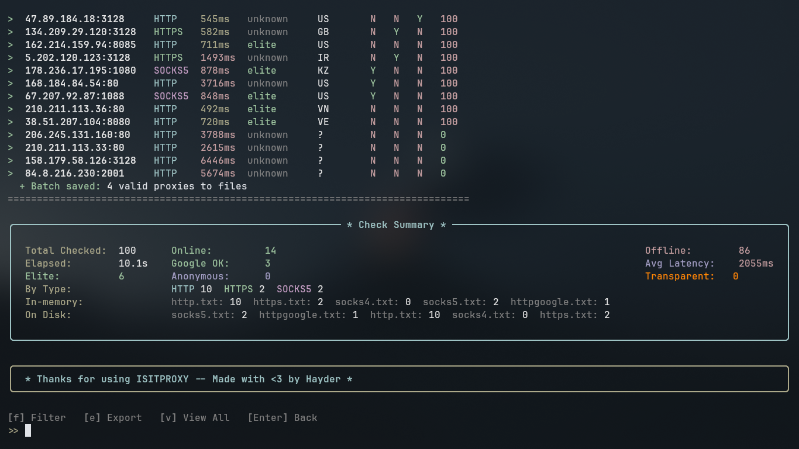</td>
    <td>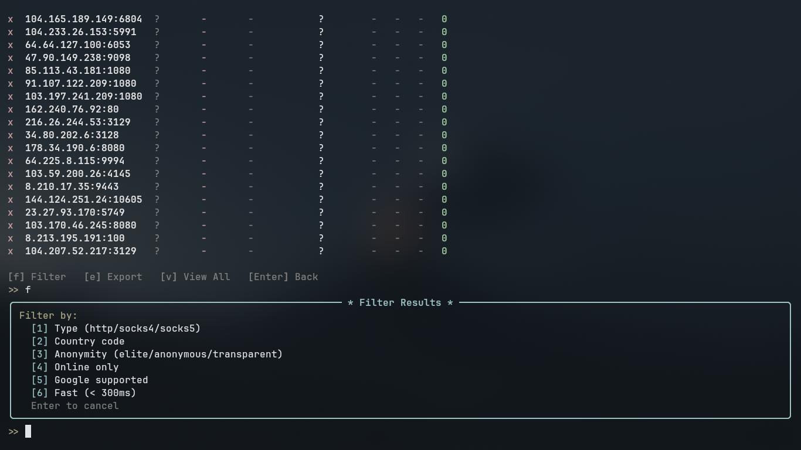</td>
  </tr>
  <tr>
    <td align="center"><b>Google Filter</b><br><sub>Find Google-accessible proxies</sub></td>
    <td align="center"><b>Proxy Success</b><br><sub>Detailed intel per proxy</sub></td>
    <td align="center"><b>Saved Results</b><br><sub>Browse saved proxy files</sub></td>
  </tr>
  <tr>
    <td>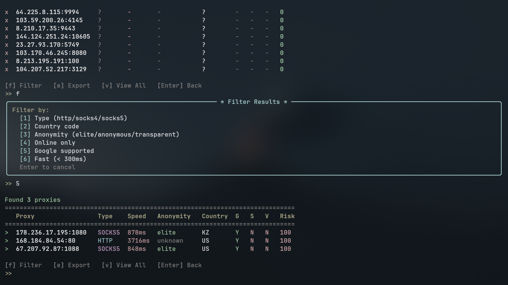</td>
    <td>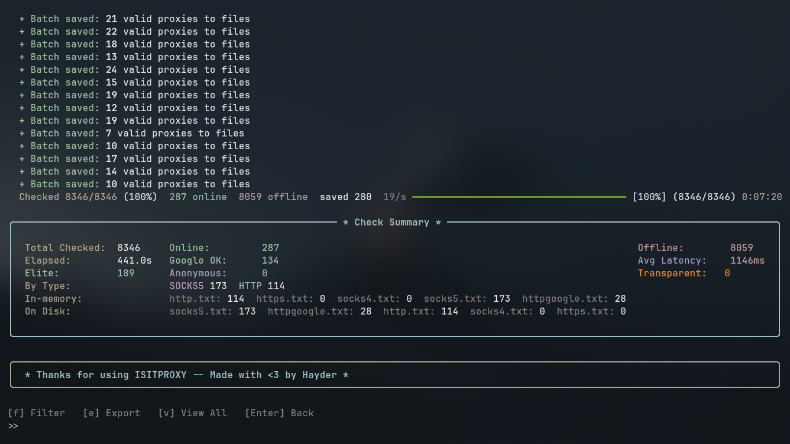</td>
    <td>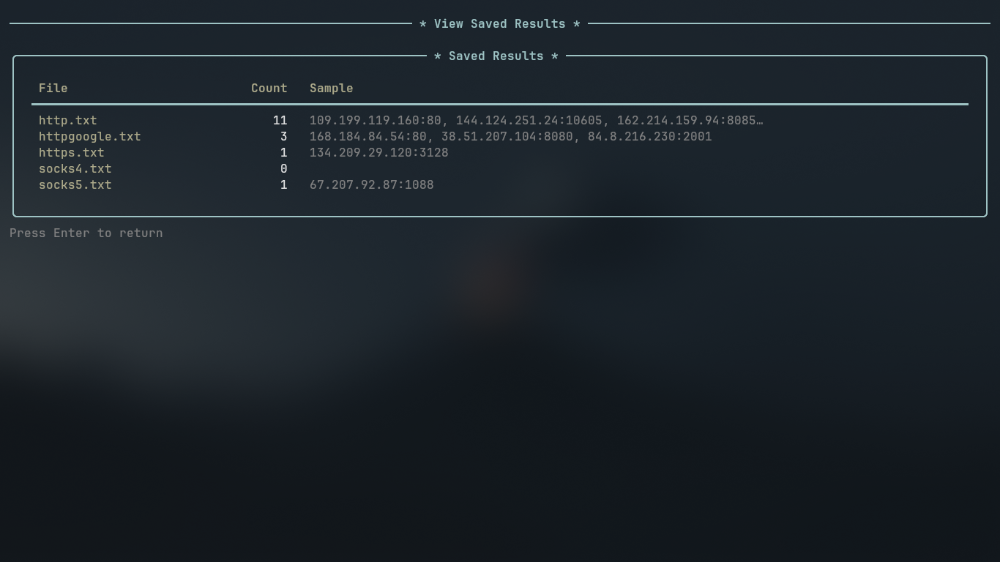</td>
  </tr>
</table>

### Scrape & Load Proxies

<table>
  <tr>
    <td align="center"><b>Scraping Proxies</b><br><sub>Fetching from 10 providers</sub></td>
    <td align="center"><b>Scrape Complete</b><br><sub>Unique proxies added</sub></td>
    <td align="center"><b>Manage Providers</b><br><sub>Add/remove proxy sources</sub></td>
  </tr>
  <tr>
    <td>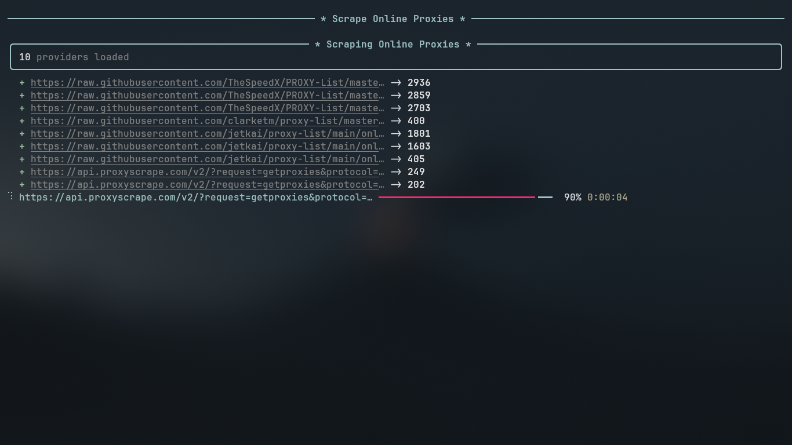</td>
    <td>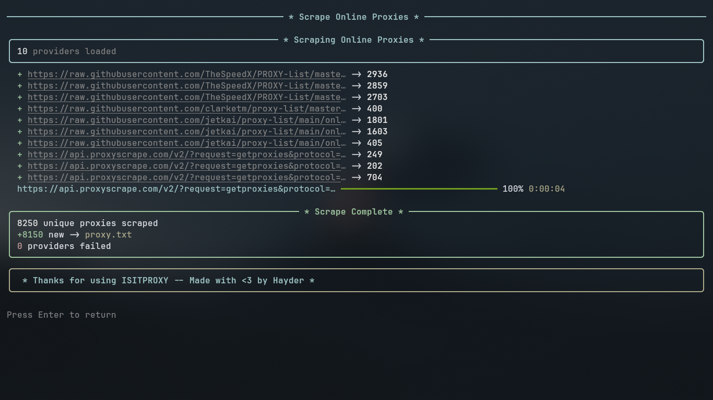</td>
    <td>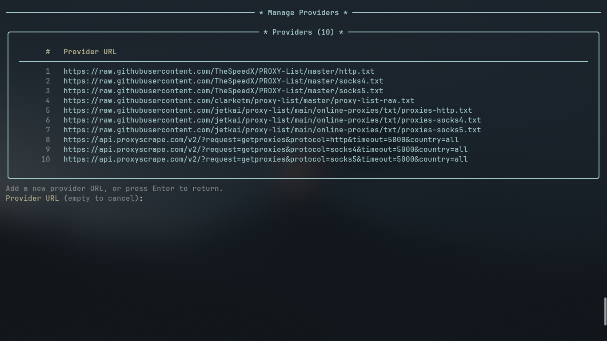</td>
  </tr>
  <tr>
    <td align="center"><b>Load from URL</b><br><sub>Import any proxy list URL</sub></td>
    <td align="center"><b>Paste from Clipboard</b><br><sub>Paste proxies directly</sub></td>
    <td align="center"><b>View Proxy File</b><br><sub>Browse loaded proxies</sub></td>
  </tr>
  <tr>
    <td>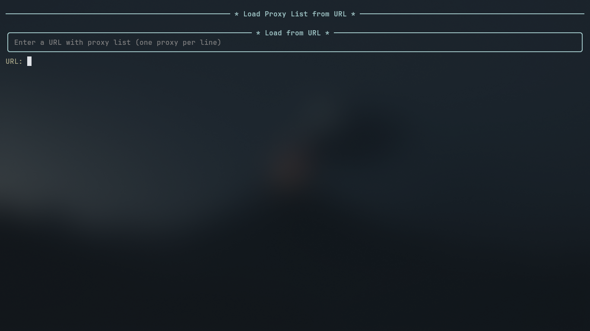</td>
    <td>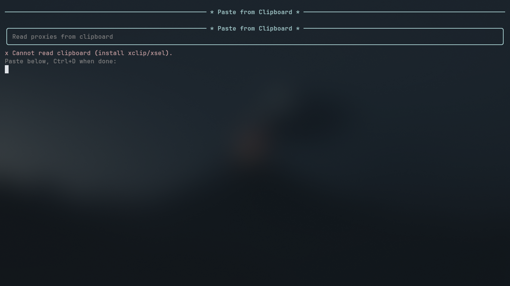</td>
    <td>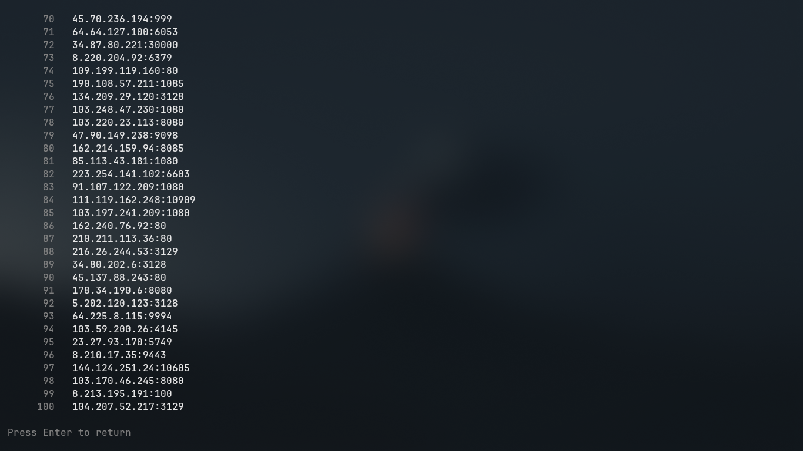</td>
  </tr>
</table>

---

## Quick Start (Easiest Way)

**1. Clone the repo:**

```bash
git clone https://github.com/qamrixtech/isitproxy.git
cd isitproxy
```

**2. Run the launcher -- it handles everything:**

<table>
  <tr>
    <th>Platform</th>
    <th>Command</th>
  </tr>
  <tr>
    <td><b>Linux</b></td>
    <td><code>./run.sh</code></td>
  </tr>
  <tr>
    <td><b>macOS</b></td>
    <td><code>./run.sh</code></td>
  </tr>
  <tr>
    <td><b>Windows</b></td>
    <td><code>python run.py</code></td>
  </tr>
  <tr>
    <td><b>WSL</b></td>
    <td><code>./run.sh</code></td>
  </tr>
</table>

The launcher will:
- Find Python 3.10+ on your system
- Create a virtual environment automatically
- Install all required packages
- Launch ISITPROXY

You don't need to install anything manually.

---

## Features

<table>
  <tr>
    <th>Check Proxies</th>
    <th>Get Intelligence</th>
  </tr>
  <tr>
    <td>

- Test HTTP, HTTPS, SOCKS4, SOCKS5
- Measure speed in real-time
- See which proxies are fast vs slow
- Auto-save working proxies to files
- Check thousands of proxies at once

</td>
    <td>

- Country and city of the proxy
- ISP / network provider
- Anonymity level (elite, anonymous, transparent)
- VPN detection
- Risk score
- Google access check

</td>
  </tr>
</table>

<table>
  <tr>
    <th>Easy to Use</th>
    <th>Flexible Settings</th>
  </tr>
  <tr>
    <td>

- Arrow-key menu navigation
- Three check modes: Fast, Standard, Custom
- Watch results live or use progress bar
- Filter and export after checking
- Works on Linux, macOS, Windows, WSL

</td>
    <td>

- Change where files are saved
- Save all proxies in one file or by type
- Auto-replace input list with working proxies
- Set your own proxycheck.io API key
- Add custom proxy sources

</td>
  </tr>
</table>

---

## Menu

| Key | What it does |
|-----|-------------|
| **1** | **Check Proxies** -- test all proxies and find the working ones |
| **2** | **Scrape Online Proxies** -- download free proxies from the internet |
| **3** | **Load from URL** -- import a proxy list from any website |
| **4** | **Paste from Clipboard** -- paste proxies you copied |
| **5** | **Manage Providers** -- add or remove proxy source URLs |
| **6** | **View Proxy File** -- see what proxies are loaded |
| **7** | **View Saved Results** -- see your saved working proxies |
| **S** | **Settings** -- API key, output folder, save mode, replace toggle |
| **H** | **Help** -- full help manual |
| **Q** | **Quit** -- exit the tool |

---

## How to Use

### Checking Proxies

1. Put your proxies in `proxy.txt` (one per line, format: `ip:port`)
2. Run ISITPROXY and select **[1] Check Proxies**
3. Pick a mode:
   - **[F] Fast** -- quick scan, HTTP/HTTPS only, saves fast proxies
   - **[S] Standard** -- checks all proxy types, balanced speed
   - **[C] Custom** -- set everything yourself
4. Choose display mode:
   - **[Y] Stream** -- see results as they come in
   - **[N] Bar** -- progress bar only
5. After checking, you can filter, export, or view all results

### Scraping Proxies

Select **[2] Scrape Online Proxies** to automatically download proxies from 10 different sources. New unique proxies are added to your `proxy.txt`.

### Loading from URL

Select **[3] Load from URL** and paste any URL that has a proxy list. The tool downloads and adds them.

### Pasting Proxies

Select **[4] Paste from Clipboard** and paste proxies directly. Great for quick one-time checks.

### Settings

Navigate with **Up/Down**, toggle with **Space**, edit with **Enter**, press **Q** to save & return.

| Setting | What it does |
|---------|-------------|
| **API Key** | Your proxycheck.io key for intel data (free at proxycheck.io/register) |
| **Output Directory** | Where result files are saved (default: `proxies/`) |
| **Replace After Check** | Automatically replace `proxy.txt` with only working proxies |
| **Single File Mode** | Save all working proxies in one file (`all.txt`) instead of by type |

---

## Proxy List Format

Put your proxies in `proxy.txt`, one per line:

```
91.228.227.23:80
31.10.83.158:8080
socks5://10.0.0.1:1080
http://5.5.5.5:3128
```

You can also use commas, pipes, or semicolons as separators.

---

## Providers

ISITPROXY comes with 10 built-in proxy sources that automatically fetch free proxies from the internet. You can add your own via **[5] Manage Providers** or edit `providers.txt`.

---

## File Structure

```
isitproxy/
  isit.py          # Main tool
  run.py           # Launcher (Windows / cross-platform)
  run.sh           # Launcher (Linux / macOS / WSL)
  proxy.txt        # Your proxy list (edit this)
  providers.txt    # Proxy source URLs
  config.json      # Your settings
  images/          # Screenshots
  proxies/         # Saved working proxies
    http.txt
    https.txt
    socks4.txt
    socks5.txt
    httpgoogle.txt
    all.txt        # (single file mode)
```

---

## Requirements

- Python 3.10 or higher
- That's it -- the launcher installs everything else automatically

---

## Platform Support

| Platform | Status | How to launch |
|----------|--------|---------------|
| Linux | Supported | `./run.sh` |
| macOS | Supported | `./run.sh` |
| Windows | Supported | `python run.py` |
| WSL | Supported | `./run.sh` |

---

## License

```
Copyright (c) 2026 Qamrix Tech. All Rights Reserved.
Developed By Hayder
```

See [LICENSE](LICENSE) for details.

---

<div align="center">


*Made with <3 by Hayder -- Qamrix Tech*

</div>
